# Claude Code Hooks Guide

A comprehensive guide to understanding and using the automated CLAUDE.md auditing system through Claude Code hooks.

## What Are Claude Code Hooks?

Claude Code hooks are automated scripts that run in response to specific events during your interaction with Claude. They enable workflow automation, validation, and maintenance tasks without manual intervention.

## The Claude Code Hook System

### Two Key Features

#### 1. Startup Context Priming
When you start a new Claude Code session, the system automatically:
- Loads your project context from CLAUDE.md
- Reminds Claude about available subagents
- Sets focus on current development priorities
- Ensures continuity between sessions

#### 2. Shutdown Audit System
The CLAUDE.md file is your project's "memory" - it helps Claude understand your project context. However, it can become cluttered with completed tasks and outdated information. This hook system automatically:
- Detects when you're ending a session
- Triggers an audit to prune old content
- Archives historical information
- Keeps CLAUDE.md lean and focused

### How It Works - Step by Step

#### Session Startup Flow


#### Session Shutdown Flow

```mermaid
graph TD
    A[You type a message] --> B{Contains shutdown keyword?}
    B -->|Yes| C[Create trigger file]
    B -->|No| D[Normal conversation]
    C --> E[Claude responds]
    E --> F[Stop hook checks trigger]
    F --> G[Create audit request]
    G --> H[Next session: Claude audits]
    H --> I[CLAUDE.md pruned]
    I --> J[Old content → CLAUDE_ARCHIVE.md]
```


## Shutdown Keywords

The system monitors for these keywords/phrases:

| Keyword | Example Usage |
|---------|---------------|
| `closing claude` | "I'm closing claude for today" |
| `shut down` / `shutdown` | "Time to shut down" |
| `goodbye` / `bye` | "Bye Claude!" |
| `done for today` | "I'm done for today" |
| `done for now` | "That's all done for now" |
| `see you later` | "See you later!" |
| `ttyl` | "ttyl" |
| `audit claude.md` | "Please audit claude.md" |
| `prune claude.md` | "Time to prune claude.md" |

## Usage Examples

### Example 1: Natural Session End
```
You: "Great work today! I'm done for now."
Claude: "Thank you! I've noted we're ending the session..."
[Hook triggers → Audit prepared for next session]
```

### Example 2: Explicit Audit Request
```
You: "Please audit claude.md before I go"
Claude: "I'll prepare the audit for processing..."
[Hook triggers → Audit prepared]
```

### Example 3: Manual Trigger
```bash
# Run in terminal
./.claude/hooks/manual-audit.sh

# Output:
# Manual CLAUDE.md audit triggered
# Backup created: .claude/backups/CLAUDE_20240108_143022.md
# Audit request created. Claude will process this on next interaction.
```

## The Audit Process

### What Gets Archived
- ✅ Completed development phases
- ✅ Implemented features documentation
- ✅ Old technical decisions that have been finalized
- ✅ Verbose explanations now in code
- ✅ Historical context no longer relevant

### What Stays in CLAUDE.md
- ✅ Current development phase and status
- ✅ Active TODOs and next steps
- ✅ Essential project context
- ✅ Key architectural decisions
- ✅ Quick reference information
- ✅ Current technical stack
- ✅ Active development guidelines

### Archive Format
```markdown
# CLAUDE_ARCHIVE.md

## Archive Entry - 2024-01-08 14:30:22

### Archived: Phase 1 Implementation Details
[Content moved from CLAUDE.md]

### Archived: Completed Database Setup
[Content moved from CLAUDE.md]

---
[Previous archive entries...]
```

## File Structure Explained

```
workshop-administration-site/
├── CLAUDE.md                 # Lean, active project context
├── CLAUDE_ARCHIVE.md        # Historical information
└── .claude/
    ├── settings.json        # Hook configuration
    ├── hooks/
    │   ├── detect-shutdown.sh    # Monitors messages
    │   ├── audit-claude-md.sh    # Processes audit
    │   └── manual-audit.sh       # Manual trigger
    ├── backups/             # Automatic backups
    │   ├── CLAUDE_20240108_143022.md
    │   └── CLAUDE_20240108_091510.md
    └── .audit-request       # Temporary trigger file
```

## Common Scenarios

### Scenario 1: Daily Development Session
```
Morning: "Hi Claude, let's continue with the auth system"
[Work on features throughout the day]
Evening: "Great progress! Done for today."
[Audit triggers → Next morning, CLAUDE.md is clean]
```

### Scenario 2: Major Milestone Completion
```
You: "We just finished Phase 1! Time to audit claude.md"
[Explicit audit request triggers]
Next session: [Phase 1 details archived, Phase 2 becomes focus]
```

### Scenario 3: Quick Check-in
```
You: "Just checking the deployment status"
Claude: [Provides status]
You: "Thanks"
[No shutdown keyword → No audit triggered]
```

## Customization Options

### Adding Custom Keywords
Edit `.claude/hooks/detect-shutdown.sh`:
```bash
SHUTDOWN_KEYWORDS=(
    "existing keywords..."
    "your-custom-phrase"
    "another-trigger"
)
```

### Changing Audit Criteria
Modify the audit template in `.claude/hooks/audit-claude-md.sh`:
```bash
cat > "$PROJECT_DIR/.claude/.audit-request" << 'EOF'
Your custom audit criteria here...
EOF
```

### Adjusting Backup Retention
Add to `.claude/hooks/audit-claude-md.sh`:
```bash
# Keep only last 10 backups
ls -t "$PROJECT_DIR/.claude/backups"/CLAUDE_*.md | tail -n +11 | xargs rm -f
```

## Troubleshooting

### Issue: Hooks Not Triggering

**Symptoms**: Saying goodbye doesn't trigger audit

**Solutions**:
1. Verify hooks are executable:
   ```bash
   ls -la .claude/hooks/*.sh
   # Should show -rwxr-xr-x permissions
   ```

2. Test detection manually:
   ```bash
   echo "goodbye" | bash .claude/hooks/detect-shutdown.sh
   # Should show: "Shutdown keyword detected: goodbye"
   ```

3. Check settings.json is valid:
   ```bash
   cat .claude/settings.json | python -m json.tool
   ```

### Issue: Audit Not Processing

**Symptoms**: Audit request exists but Claude doesn't process it

**Solutions**:
1. Check for request file:
   ```bash
   ls -la .claude/.audit-request
   ```

2. Manually trigger:
   ```
   You: "Please check for and process any audit requests"
   ```

3. Clear and retry:
   ```bash
   rm .claude/.audit-request
   ./.claude/hooks/manual-audit.sh
   ```

### Issue: Wrong Content Archived

**Symptoms**: Important content moved to archive

**Solutions**:
1. Restore from backup:
   ```bash
   cp .claude/backups/CLAUDE_[timestamp].md CLAUDE.md
   ```

2. Manually move content back:
   ```
   You: "Please move [specific section] from CLAUDE_ARCHIVE.md back to CLAUDE.md"
   ```

## Best Practices

### 1. Regular Reviews
- Let automatic audits run naturally at session end
- Review CLAUDE_ARCHIVE.md monthly for useful patterns
- Clean up old backups quarterly

### 2. Strategic Timing
- Best audit times:
  - ✅ End of work session
  - ✅ After completing major features
  - ✅ Before starting new development phase
  - ❌ Not during active debugging
  - ❌ Not mid-feature development

### 3. Keyword Usage
- Be natural - "See you later!" works great
- Use explicit requests for immediate audits
- Avoid keywords in code comments or documentation

### 4. Backup Management
```bash
# View backups by size
du -h .claude/backups/*.md | sort -h

# Keep only last 30 days
find .claude/backups -name "CLAUDE_*.md" -mtime +30 -delete

# Archive old backups
tar -czf claude-backups-2024.tar.gz .claude/backups/CLAUDE_2024*.md
```

### 5. Content Guidelines

**Keep in CLAUDE.md**:
- Current sprint/phase goals
- Active architectural decisions
- TODO lists and next steps
- Key project constraints
- Essential context (< 200 lines ideal)

**Move to Archive**:
- Completed feature documentation
- Old meeting notes
- Resolved technical debates
- Implementation details now in code
- Historical decision rationale

## Advanced Usage

### Conditional Audits
Create specialized audit triggers:
```bash
# In detect-shutdown.sh, add conditional logic
if [[ "$MESSAGE_LOWER" == *"major audit"* ]]; then
    echo "MAJOR_AUDIT" > "$PROJECT_DIR/.claude/.audit-type"
    touch "$TRIGGER_FILE"
fi
```

### Automated Reports
Generate audit statistics:
```bash
#!/bin/bash
# audit-stats.sh
echo "CLAUDE.md Statistics:"
wc -l CLAUDE.md
echo "Archive entries:"
grep -c "^## Archive Entry" CLAUDE_ARCHIVE.md
echo "Total backups:"
ls -1 .claude/backups/*.md 2>/dev/null | wc -l
```

### Integration with Git
Add pre-commit hook to ensure CLAUDE.md stays lean:
```bash
#!/bin/bash
# .git/hooks/pre-commit
MAX_LINES=300
LINES=$(wc -l < CLAUDE.md)
if [ $LINES -gt $MAX_LINES ]; then
    echo "Warning: CLAUDE.md has $LINES lines (max: $MAX_LINES)"
    echo "Consider running: ./.claude/hooks/manual-audit.sh"
fi
```

## Security Considerations

1. **Hooks run with your permissions** - Only use trusted scripts
2. **Avoid sensitive data** in CLAUDE.md - It gets backed up
3. **Review hook changes** before pulling from git
4. **Backup location** - Ensure .claude/backups/ isn't exposed

## FAQ

**Q: Can I disable hooks temporarily?**
A: Yes, rename `.claude/settings.json` to `.claude/settings.json.disabled`

**Q: How often should audits run?**
A: Naturally at session end is usually sufficient. Weekly is a good rhythm.

**Q: What if I accidentally trigger an audit?**
A: Backups are created automatically. Restore with: `cp .claude/backups/CLAUDE_[newest].md CLAUDE.md`

**Q: Can multiple people use these hooks?**
A: Yes, but coordinate audit timing to avoid conflicts.

**Q: Do hooks work in all shells?**
A: Yes, they use `/bin/bash` explicitly for consistency.

## Summary

The Claude Code hooks system provides:
- 🚀 **Automatic maintenance** - No manual cleanup needed
- 📚 **Historical preservation** - Nothing important is lost
- 🎯 **Focused context** - CLAUDE.md stays relevant
- 🔄 **Seamless workflow** - Works with natural conversation
- 🛡️ **Safe operation** - Automatic backups prevent data loss

By using these hooks, you maintain an optimal balance between comprehensive project history and focused, actionable context for productive Claude Code sessions.

---

*For technical implementation details, see [CLAUDE_HOOKS.md](./CLAUDE_HOOKS.md)*